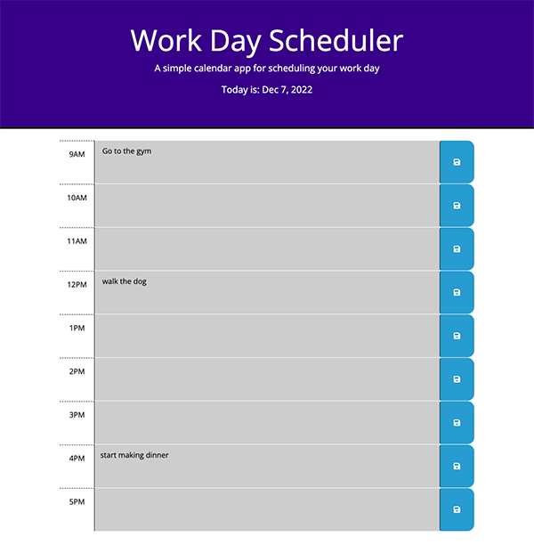

# hourly-day-planner

## Table of Contents
- [Description](#Description)
- [Usage](#Usage)
- [Visuals](#Visuals)

## Description
[Click here to view my houry day planner](https://mariahmcdaniel.github.io/hourly-day-planner/)

For this project, I created an hourly day planner so that the user can create a daily schedule that will save their events. I have utilized local storage so they can still view their plans after the page is refreshed. One of the features of this planner is the color of the time blocks. They will change hourly to reflect whether the block in question is past the current hour, for the current hour, or still yet to come. Another feature of this planner is the color of the header, which will change depending on the time of day it is being accessed. 

## Usage
To use this hourly day planner, once you've navigated to the [application](https://mariahmcdaniel.github.io/hourly-day-planner/), click the time-block for which you would like schedule an event. Next, type your event description into the text area and press the save button, located to the right of the time block where you've recorded your event. 

## Visuals
Day planner evening view:

Save button:

